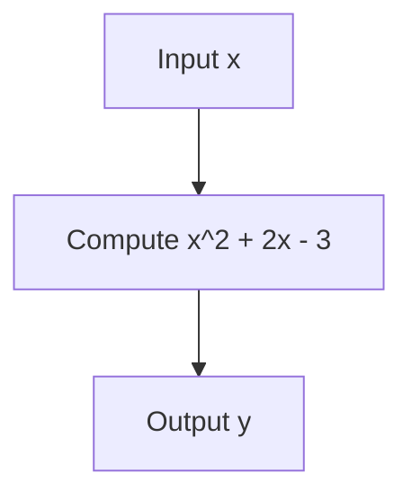
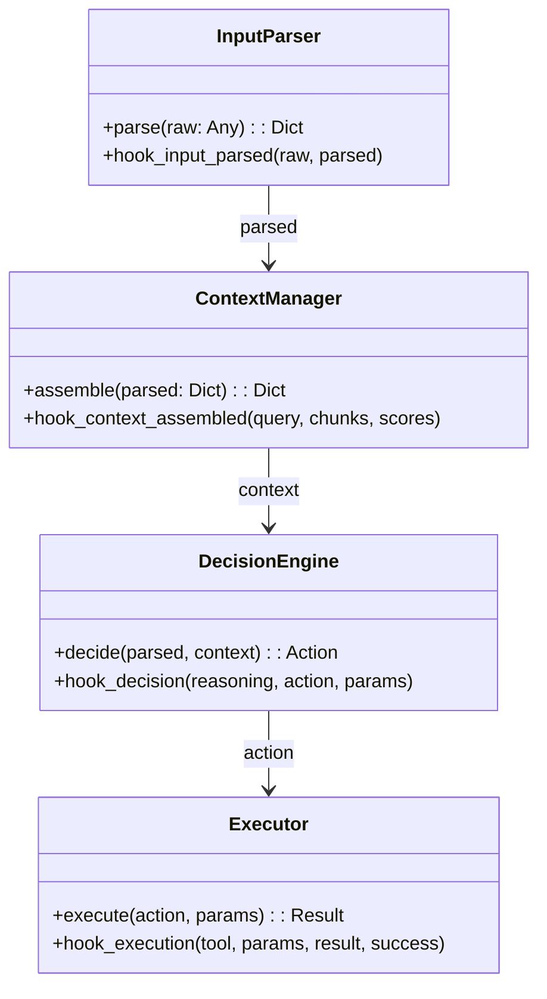
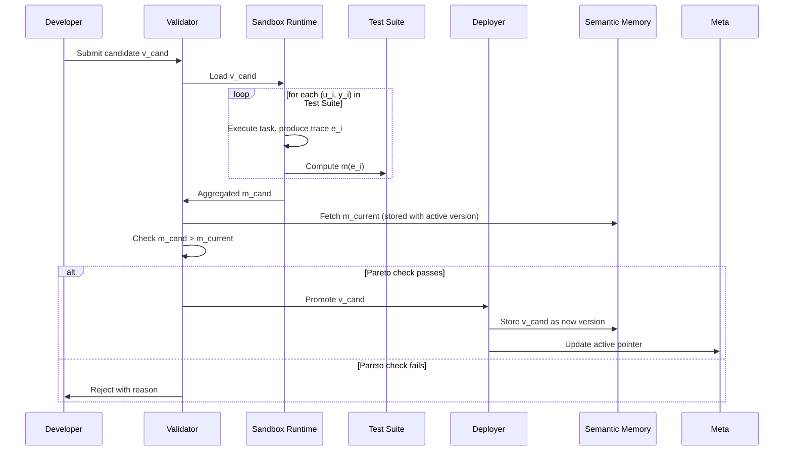

Plot the function

$$y = x^2 + 2x - 3$$

and verify it matches this flow:

# Chapter 1: Introduction

## 1.1 Background

The rapid advancement of large language models (LLMs) has given rise to a new class of software systems known as autonomous agents. These agents combine natural language understanding, reasoning, retrieval of external knowledge, and interaction with tools to perform complex multi‑step tasks. Developers can now assemble agents by composing specialised components: a retrieval module fetches relevant documents from a knowledge base, a reasoning module decides on the next action or produces a final answer, and a collection of tool executors carries out commands in the digital or physical world. This compositional approach, supported by frameworks such as LangGraph and DSPy, has enabled remarkable flexibility and capability.

Despite these advances, the process of maintaining and improving such agents remains fraught with risk. An agent’s behaviour emerges from the intricate interplay of its components, and even a well‑intentioned modification to one part — for instance, a new prompt template, a different embedding model, or a revised tool‑calling strategy — can silently break previously reliable functionality. In production environments, where trust and stability are critical, any unverified degradation can have serious consequences. The fundamental challenge is not the initial construction of agents but their ongoing, safe evolution.

## 1.2 Problem Statement

Current practices for updating LLM‑based agents lack formal guarantees against performance regression. Developers typically rely on ad‑hoc manual testing or a handful of example queries to validate a change. This approach is insufficient because agent performance is multi‑dimensional: a change that improves answer accuracy might simultaneously increase the retrieval of irrelevant context, introduce semantic drift over the course of a conversation, or cause tool invocations to fail silently. Traditional regression testing, while valuable, evaluates only whether specific outputs match expected values; it does not provide a principled framework for deciding whether a change is acceptable when multiple quality dimensions are affected.

Furthermore, there is no standardised, auditable mechanism for managing the lifecycle of agent skills. Without versioned, component‑level tracking and a rigorous promotion process, it is difficult to trace why a particular behaviour changed or to roll back a faulty update to a known good state. This fragility inhibits the development of reliable, continuously improving agent systems and is particularly concerning as agents are deployed in high‑stakes domains such as healthcare, legal research, and personal assistants.

## 1.3 Proposed Solution

This project addresses the problem by introducing a hierarchical memory architecture that enforces a provable non‑regression guarantee on all skill updates. The architecture organises an agent’s knowledge into four distinct memory tiers inspired by cognitive psychology: working memory, episodic memory, semantic memory, and meta‑memory. Every agent skill is decomposed into four atomically replaceable components — Input Parser, Context Manager, Decision Engine, and Executor — each with a well‑defined interface and observability hooks.

To quantify skill quality, we define five deterministic, computable metrics termed moat observabilities: Decision Traceability, Context Fidelity, Tool Execution Veracity, Semantic Drift, and Human Intervention Velocity. These metrics are computed directly from execution traces without reliance on subjective language model judgments, ensuring objectivity.

The core innovation is a safe update mechanism based on the Pareto improvement principle. A new version of a skill is accepted only if every one of the five metrics is at least as high as the current production version and at least one metric is strictly higher. This rule mathematically guarantees that accepted updates never degrade performance on any measured dimension with respect to a curated regression test suite. The entire framework is built using only free, locally executable models and lightweight databases, making it accessible to developers with limited hardware resources.

## 1.4 Research Questions

This project is guided by the following research questions:

1. How can a hierarchical memory architecture support safe, versioned skill evolution in LLM‑based agents?
2. What set of deterministic, computable metrics can capture the multi‑dimensional quality of an agent skill?
3. How can a formal Pareto improvement rule be applied to skill promotion to guarantee non‑regression?
4. Can a minimal prototype demonstrate the feasibility and correctness of the non‑regression guarantee using only free, local resources?

## 1.5 Scope and Delimitations

The project focuses on the design and prototyping of the memory architecture and the non‑regression validation mechanism. It does not aim to create a fully autonomous self‑evolution loop where an LLM generates skill variants automatically; rather, skill variants are authored by a developer. The system is evaluated on a small, curated test suite and a single retrieval‑augmented question‑answering task to demonstrate the core principles. While the architecture is extensible to multi‑agent settings, the prototype implements a single agent with multiple versioned retrieval skills. The evaluation is limited to the five defined metrics; other quality dimensions such as latency, cost, or user satisfaction are not considered in this work.

## 1.6 Report Structure

The remainder of this report is organised as follows. Chapter 2 reviews relevant literature on cognitive architectures, self‑improving agents, skill decomposition, and safe update mechanisms. Chapter 3 presents the system design and architecture in detail, including the memory hierarchy, atomic skill interface, metric definitions, and the validation protocol. Chapter 4 describes the implementation of the proof‑of‑concept prototype and the testing process. Chapter 5 evaluates the system against the research questions, discusses limitations, and concludes with directions for future work.

# Chapter 2: Literature Review

## 2.1 Cognitive Memory Architectures

The notion that an intelligent system can be organised around distinct memory stores traces its roots to foundational work in cognitive psychology. Atkinson and Shiffrin (1968) proposed a multi‑store model that separated sensory memory, short‑term memory, and long‑term memory, each with different capacities and persistence. Baddeley and Hitch (1974) refined the short‑term store into a working memory system with multiple components, while Tulving (1972) drew a critical distinction within long‑term memory between episodic memory (personal experiences tied to time and place) and semantic memory (general knowledge and facts). These conceptual divisions have deeply influenced artificial intelligence.

In AI, cognitive architectures such as ACT‑R (Anderson & Lebiere, 1998) and SOAR (Laird, 2012) operationalised memory hierarchies by maintaining separate declarative and procedural memories and using production rules to govern behaviour. More recently, Park et al. (2023) demonstrated generative agents that used a hybrid memory stream: agents retrieved past experiences (episodic) and world knowledge (semantic) to inform their behaviour in a simulated environment. These works validate the utility of memory hierarchies for organising complex agent behaviour, but they do not address how the knowledge stored in those memories — particularly the skills an agent uses — can be safely updated over time. Our work extends the cognitive memory model to the domain of LLM‑based agent skill management, treating executable skills as versioned semantic memories and enforcing a formal update discipline.

## 2.2 Self‑Improving Language Agents

The capacity of large language models to reason about their own outputs has spurred research into agents that can improve autonomously. Shinn et al. (2023) introduced Reflexion, where an agent verbally reflects on a failure trajectory and uses that reflection as additional context in subsequent attempts. While this loop can correct single‑task errors, the learned lessons are not persisted across tasks, nor is there any guarantee that the new behaviour will not regress on previously solved tasks.

Wang et al. (2024) proposed Skills‑Coach, an interactive system in which a human and an LLM collaborate to decompose tasks into named skills that are stored in a library for future reuse. This marked an important step toward treating skills as persistent, retrievable units. Voyager (Wang et al., 2023) took the idea further by building an agent that autonomously writes and refines code skills in the Minecraft environment, storing them in a vector database and retrieving them by embedding similarity. Voyager’s skill manager demonstrates the power of a versioned, searchable skill library. However, it lacks any formal non‑regression constraint: a newly synthesised skill simply replaces the old one, with no guarantee that previously mastered tasks remain solvable. Our project directly addresses this shortcoming by adding a validation gate based on quantitative metrics.

## 2.3 Modular Agent Frameworks and Skill Decomposition

The decomposition of agent behaviour into smaller, independently manageable modules is a principle borrowed from software engineering and recently applied to LLM‑based systems. Khattab et al. (2023) developed DSPy, a programming framework that treats every LLM call as a declarative module with a defined input‑output signature. DSPy’s teleprompter can optimise module prompts using a metric‑driven compiler, and the modules are composable. This modularity resembles our atomic skill interface, where each skill is split into four components with clear boundaries. Similarly, LangGraph (Chase, 2023) encourages developers to construct agents as stateful graphs of discrete nodes, each representing a reasoning step or tool invocation, enabling fine‑grained inspection and modification.

These frameworks provide the technical foundation for building agents out of replaceable parts, but they do not prescribe how the parts should be versioned, tested, and promoted. Our work builds on their composability by defining a fixed four‑component interface and coupling it with a memory hierarchy that tracks versions and enforces a formal promotion policy.

## 2.4 Agent Observability and Evaluation Metrics

Reliable evaluation is essential for any safe update mechanism. Traditional benchmarks such as HotpotQA (Yang et al., 2018) and StrategyQA (Geva et al., 2021) measure end‑to‑end task success but offer little insight into which internal component caused a failure. AgentBench (Liu et al., 2023) addresses this to some extent by evaluating reasoning, tool use, and planning separately. In the observability domain, tools like LangSmith (2024) and Phoenix (Arize AI, 2024) capture detailed execution traces — prompts, retrieved documents, intermediate outputs — enabling developers to compute component‑level diagnostics.

We draw on this trace‑based approach to define five moat observability metrics. Unlike ad‑hoc inspection, our metrics are designed to be computed deterministically from the trace, without any reliance on subjective LLM judgments. This determinism is critical for the mathematical non‑regression guarantee we aim to provide.

## 2.5 Safe Update Mechanisms and Continual Learning

The challenge of updating a system without degrading existing capabilities is well studied in both software engineering and machine learning. Regression testing and continuous integration pipelines are standard practices for catching unintended breakages, but they typically rely on binary pass/fail assertions. When a change affects multiple quality dimensions — some improving, others worsening — a principled decision procedure is needed. Multi‑objective optimisation offers the concept of Pareto improvement (Miettinen, 1999): a change is accepted if it makes no objective worse and at least one better. To our knowledge, this principle has not been directly applied as a promotion gate for agent skill versions.

In machine learning, continual learning research addresses the problem of catastrophic forgetting. Techniques such as elastic weight consolidation (Kirkpatrick et al., 2017) and experience replay (Rolnick et al., 2019) constrain the update process to preserve knowledge of old tasks. Our work can be seen as a discrete, test‑suite‑based analogue: instead of constraining model weights, we constrain the accepted versions of skill code using a Pareto condition on a fixed set of metrics. This provides a formal non‑regression guarantee without requiring access to model internals or training data.

## 2.6 Summary and Research Gap

The literature provides rich components: cognitive memory hierarchies for organising agent knowledge, self‑reflection and skill libraries for improvement, modular frameworks for composable skills, trace‑based tools for observability, and continual learning techniques for preventing forgetting. However, no existing system combines these elements into a single architecture that (a) treats agent skills as versioned semantic memories, (b) decomposes skills into atomically replaceable components, (c) defines a fixed set of deterministic quality metrics, and (d) enforces a provable Pareto‑based non‑regression guarantee on every skill update. This project occupies that intersection, offering a principled and practical foundation for safe agent skill evolution.

## Chapter 3: System Design and Architecture

### 3.1 Overall Architecture Overview

The proposed system is built on two fundamental pillars: a **hierarchical memory model** that separates transient and persistent knowledge, and a **safe skill update pipeline** that mathematically guarantees no performance regression. Figure 3.1 shows the high‑level architecture, illustrating how the four memory tiers interact with the two operational loops: the *online execution loop* that serves user requests using the currently active skill, and the *offline validation loop* that evaluates candidate skill versions and promotes only those satisfying a strict Pareto improvement condition.

Plot the function

$$y = x^2 + 2x - 3$$
        

**Figure 3.1: System architecture. Solid arrows represent data flow; dashed arrows represent control or configuration references.**

The design is guided by three principles:

1. **Strict memory separation** – every piece of data belongs to exactly one memory tier, with well‑defined read/write permissions.
2. **Atomic skill decomposition** – every agent capability is composed of four independent components, each instrumented with observability hooks.
3. **Provable safety** – no skill version is promoted unless it strictly Pareto‑dominates the current active version across five quantitative, deterministically computed metrics on a fixed regression suite.

### 3.2 Hierarchical Memory Model

The memory architecture is inspired directly by cognitive models of human memory. It consists of four tiers, summarised in Table 3.1.

| Tier | Contents | Persistence | Mutable by |
|------|----------|-------------|------------|
| Working Memory | Current task state (parsed input, retrieved context, reasoning, tool results) | Single task | Agent runtime |
| Episodic Memory | Complete execution traces including all component states and computed metrics | Append‑only | Agent runtime (write) |
| Semantic Memory | Versioned skill components (code, prompts, embeddings) | Permanent, versioned | Deployer (controlled) |
| Meta‑Memory | Active version pointer, test suite, safety thresholds, allowed tools | Permanent, rarely changed | Developer (manual) |

**Table 3.1: Summary of the four memory tiers.**

#### 3.2.1 Working Memory

Working memory holds all transient data relevant to a single task execution. Let a task be defined by its raw input $u$. The working memory $W$ for task $u$ contains:

- $p = \text{InputParser}(u)$ – structured representation,
- $C = \text{ContextManager}(p)$ – assembled context (e.g., retrieved documents),
- $r = \text{DecisionEngine}(p, C)$ – reasoning trace and selected action,
- $o = \text{Executor}(r.\text{action})$ – tool output and system success flag.

Working memory is discarded after the task completes. Its contents are first serialised into an episodic trace.

#### 3.2.2 Episodic Memory

Episodic memory $\mathcal{E}$ is an append‑only log of task executions. For the $k$-th task, the stored trace is a tuple:

$$e_k = (t_k, u_k, s_k, v_k, p_k, C_k, r_k, o_k, \mathbf{m}_k)$$

where $t_k$ is a timestamp, $u_k$ the input, $s_k$ the task outcome, $v_k$ the active skill version used, and $\mathbf{m}_k = (m_{\text{DT}}, m_{\text{CF}}, m_{\text{TEV}}, m_{\text{SD}}, m_{\text{HIV}})$ the vector of five observability metrics. $\mathcal{E}$ is immutable under normal operation – entries are never deleted or modified.

#### 3.2.3 Semantic Memory

Semantic memory $\mathcal{S}$ stores all known versions of every skill component. A skill $S$ is a composition of four atomic components:

$$S = (\mathcal{I}, \mathcal{C}, \mathcal{D}, \mathcal{X})$$

where $\mathcal{I}$ is the Input Parser, $\mathcal{C}$ the Context Manager, $\mathcal{D}$ the Decision Engine, and $\mathcal{X}$ the Executor. Each version of a component is stored immutably with a unique version identifier. Additionally, an embedding vector $\mathbf{e}_S \in \mathbb{R}^{d}$ of the skill’s definition is indexed in a vector database to enable similarity‑based retrieval of past variants. Semantic memory is modified **only** by the Deployer after a successful validation.

#### 3.2.4 Meta‑Memory

Meta‑memory $\mathcal{M}$ contains the configuration that governs system operation:

- $\text{active}(A) \in \mathbb{N}$ – the version number of the currently active skill for agent $A$,
- $\mathcal{T} = \{(u_i, y_i)\}_{i=1}^{N}$ – the regression test suite, where $y_i$ is the expected answer or reference,
- $\tau$ – numerical tolerance for Pareto comparison,
- $\mathcal{A}_{\text{allowed}}$ – set of permitted tool actions (safety boundary).

$\mathcal{M}$ is stored in a version‑controlled file and is only updated manually by a developer.

### 3.3 Atomic Skill Interface

Every agent skill is decomposed into four independently replaceable components, each conforming to a strict interface that exposes its internal state for inspection.

    

**Figure 3.2: Atomic skill components and data flow.**

#### 3.3.1 Component Specifications

- **InputParser** $\mathcal{I}: \mathcal{U} \to \mathcal{P}$ transforms raw input $u \in \mathcal{U}$ into a structured dictionary $p \in \mathcal{P}$.
- **ContextManager** $\mathcal{C}: \mathcal{P} \to \mathcal{K}$ assembles relevant knowledge $C \in \mathcal{K}$ (e.g., retrieved documents) from semantic memory or external tools.
- **DecisionEngine** $\mathcal{D}: \mathcal{P} \times \mathcal{K} \to \mathcal{A}$ produces an action $a \in \mathcal{A}$ (tool call or final answer) together with a reasoning trace.
- **Executor** $\mathcal{X}: \mathcal{A} \to \mathcal{O} \times \{0,1\}$ invokes the chosen tool and returns the result $o \in \mathcal{O}$ along with a system‑level success flag $\sigma \in \{0,1\}$.

Observability hooks are injected at runtime. They log all inputs and outputs of each component, ensuring that the full causal chain from $u$ to the final output is recorded.

### 3.4 Moat Observability Metrics

The quality of a skill version is quantified by a vector of five deterministic metrics, computed solely from the episodic trace of a task.

Let $e = (u, p, C, r, a, o, \sigma)$ be a trace. Define the embedding function $\phi: \mathcal{T} \to \mathbb{R}^{d}$ that maps text to a fixed‑dimensional vector (using a frozen sentence‑transformer model).

#### Decision Traceability (DT)

For a task trace, let $D$ be the set of atomic decisions (actions chosen). A decision is *traceable* if its full causal chain is present. Then:

$$\text{DT}(e) = \frac{| \{ d \in D : \text{causal\_path}(d) \text{ is complete} \} |}{|D|}$$

When all components are instrumented, $\text{DT} = 1$.

#### Context Fidelity (CF)

Let $C = \{c_1, \dots, c_k\}$ be the retrieved context chunks, and $y$ the ground‑truth answer (from the test suite). The relevance of chunk $c_j$ is its cosine similarity to $y$:

$$\text{sim}(c_j, y) = \frac{ \phi(c_j) \cdot \phi(y) }{ \|\phi(c_j)\| \, \|\phi(y)\| }$$

Then:

$$\text{CF}(e) = \frac{1}{k} \sum_{j=1}^{k} \max(0, \text{sim}(c_j, y))$$

Higher CF indicates more relevant retrieved context.

#### Tool Execution Veracity (TEV)

Let $\mathcal{T}$ be the set of tool calls in the trace. For each call, compare the agent’s self‑reported success $\hat{\sigma}_t$ with the system‑level flag $\sigma_t$:

$$\text{TEV}(e) = \frac{ |\{ t \in \mathcal{T} : \hat{\sigma}_t = 1 \land \sigma_t = 1 \}| }{ |\mathcal{T}| }$$

If no tools are used, $\text{TEV} = 1$ by convention.

#### Semantic Drift (SD)

Let $v_0 = \phi(u)$ be the embedding of the task input, and $v_f = \phi(r)$ be the embedding of the final reasoning trace (or concatenated context). The semantic drift is defined as:

$$\Delta(e) = 1 - \frac{ v_0 \cdot v_f }{ \|v_0\| \, \|v_f\| }$$

We define the metric as the complement, so that larger values are better:

$$\text{SD}(e) = 1 - \Delta(e) = \frac{ v_0 \cdot v_f }{ \|v_0\| \, \|v_f\| }$$

#### Human Intervention Velocity (HIV)

A task is flagged with a binary intervention indicator $h \in \{0,1\}$ (1 means human correction was required). Over a set of tasks $E$, the intervention rate is:

$$\text{HIV}_{\text{raw}}(E) = \frac{ \sum_{e \in E} h_e }{ |E| }$$

The metric used for optimisation is its complement:

$$\text{HIV}(E) = 1 - \text{HIV}_{\text{raw}}(E)$$

All five metrics lie in $[0,1]$, with $1$ representing optimal quality.

#### 3.4.1 Aggregated Metric Vector

Given a skill version $v$ and a regression test suite $\mathcal{T} = \{(u_i, y_i)\}_{i=1}^{N}$, the version’s quality vector is computed by running $v$ on each task, obtaining a trace $e_i$, and averaging:

$$\mathbf{m}(v) = \frac{1}{N} \sum_{i=1}^{N} \mathbf{m}(e_i)$$

where $\mathbf{m}(e) = (\text{DT}(e), \text{CF}(e), \text{TEV}(e), \text{SD}(e), \text{HIV}(e))$. This vector is deterministic given the test suite.

### 3.5 Safe Skill Update Mechanism

The promotion of a new skill version is governed by a strict Pareto improvement rule.

**Definition 1 (Pareto Dominance).**  
Let $\mathbf{m}, \mathbf{m}' \in [0,1]^5$ be metric vectors. $\mathbf{m}'$ **strictly Pareto‑dominates** $\mathbf{m}$, written $\mathbf{m}' \succ \mathbf{m}$, if and only if:

1. $\forall i \in \{1,\dots,5\}, \; m'_i \ge m_i - \epsilon$ (no metric worsens), and
2. $\exists j \in \{1,\dots,5\}, \; m'_j > m_j + \epsilon$ (at least one metric strictly improves),

where $\epsilon$ is a small tolerance (e.g., $10^{-6}$) to account for floating‑point noise.

**Promotion Rule.**  
Let $v_{\text{current}}$ be the active skill version with metric vector $\mathbf{m}_{\text{current}}$, and $v_{\text{cand}}$ a candidate version with vector $\mathbf{m}_{\text{cand}}$. The candidate is accepted if and only if $\mathbf{m}_{\text{cand}} \succ \mathbf{m}_{\text{current}}$.

This rule guarantees that the sequence of accepted versions forms a monotonically non‑decreasing trajectory in all five quality dimensions with respect to $\mathcal{T}$.

#### 3.5.1 Validation Protocol

**Figure 3.3: Validation and deployment protocol.**

The protocol ensures that no version is deployed without having demonstrated strict improvement on every dimension measured by the test suite.

### 3.6 Multi‑Agent Extension (Design)

Although the prototype focuses on a single agent, the architecture extends naturally to multi‑agent systems. Multiple agents $\{A_1, A_2, \dots\}$ each have their own active version pointer in meta‑memory but share the same episodic and semantic memory stores. Traces are tagged with agent identifiers, enabling cross‑agent failure analysis. A future enhancement could allow a validated improvement to a shared Context Manager, for example, to be promoted for all agents that depend on it after a single validation.

### 3.7 Summary

This chapter has presented the formal design of a hierarchical memory architecture that supports atomic skill decomposition and provides a mathematically rigorous safe update mechanism. The combination of deterministic observability metrics and a Pareto‑based promotion rule guarantees non‑regression with respect to the regression test suite, while the cognitive memory model ensures separation of concerns and full auditability.
